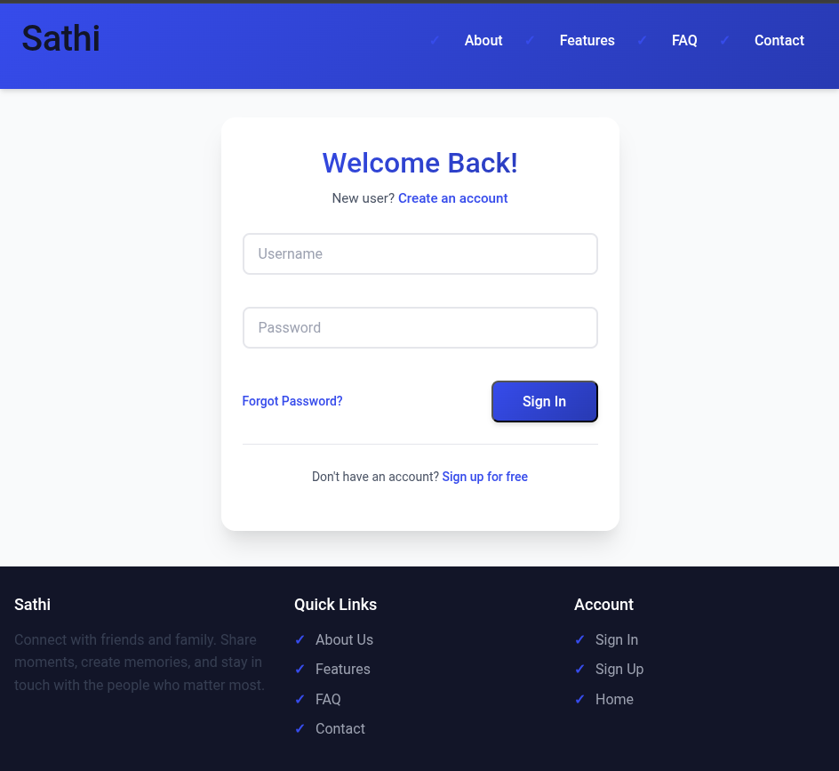
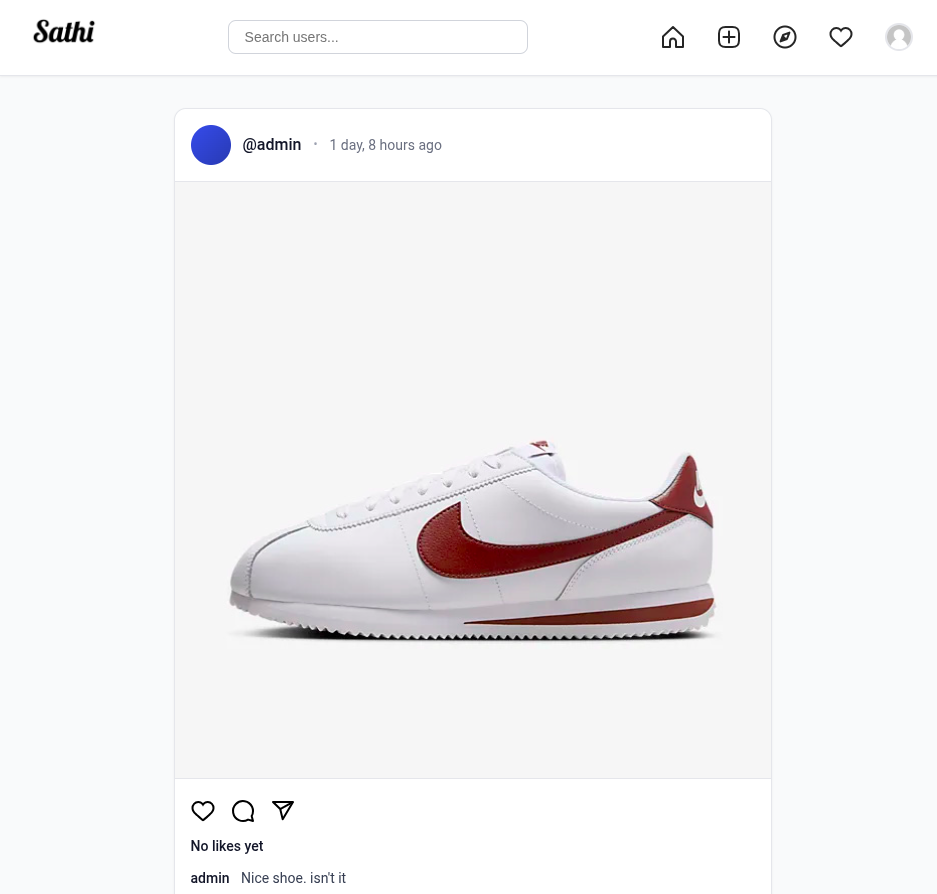
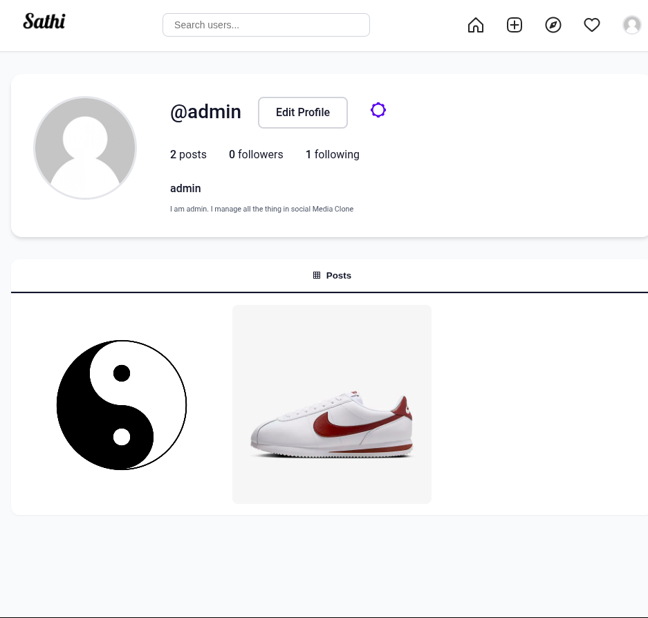

## Social-media-clone-using-Django
This project aims to create a social media platform using the Django web framework, inspired by popular social media platforms. The application will include functionalities for user registration, login, profile management, posting, following other users, and more, providing a basic yet functional social media experience.

## Quick Start Guide

1. Clone the repository:
    ```bash
    git clone https://github.com/realsanjeev/Social-media-clone-using-Django.git social-clone
    cd social-clone
    ```

2. Create a virtual environment:  
   **For Linux and macOS:**
    ```bash
    python3 -m venv venv
    source venv/bin/activate
    ```
   **For Windows:**
    ```bash
    python -m venv venv
    .\venv\Scripts\activate
    ```

3. Install dependencies:
    ```bash
    pip install -r requirements.txt
    ```

4. Apply database migrations:
    ```bash
    python manage.py makemigrations
    python manage.py migrate
    ```

5. Start the web server:
    ```bash
    python manage.py runserver
    ```

For demo login, use **admin** as both the username and password.

### Features:
- User registration and authentication system
- User profile management (bio, avatar, and other details)
- Post and share updates, images, and multimedia content
- News feed showing posts from followed users
- Follow/unfollow functionality to connect with others

### Ouput Preview
#### SignIn

#### Home


#### Profile


> To run with debug=False in localmachine use python manage.py runserver --insecure